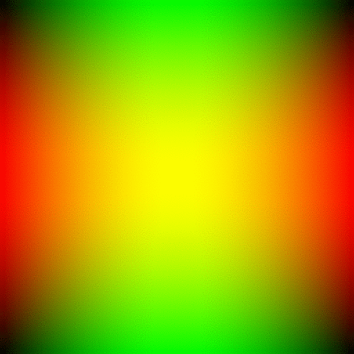

# Hello World!

This is my home page! My name is Lawrence Cui and I am a student at [Cal State Fullerton](http://www.fullerton.edu/) and my major is Computer Science.

## Computer Science Projects

My GitHub page is http://github.com/Lcui97.

### CPSC 120

* Lab 7

Lab 7, where we coded a simple blackjack game, was one of my favorite labs of the semester. We had already created a simple card game a few labs prior, but this one was much more fleshed out. Working on the code really helped me understand how booleans worked and taught me how to take command line arguments as input. 

* Lab 8

Lab 8 was another favorite of mine. This lab taught us how to create ASCII art using a nested for-loop. The code itself is very simple, but it required an understanding of how a nested for-loop executes to make it work. It felt like magic. 

* Lab 12

Lab 12 was by far the most interesting. This lab taught us how to output a .gif file to create a sort of “flipbook” style image which takes the form of an animated color-changing gradient. Understanding how the effect is achieved through code was mind-blowing!

